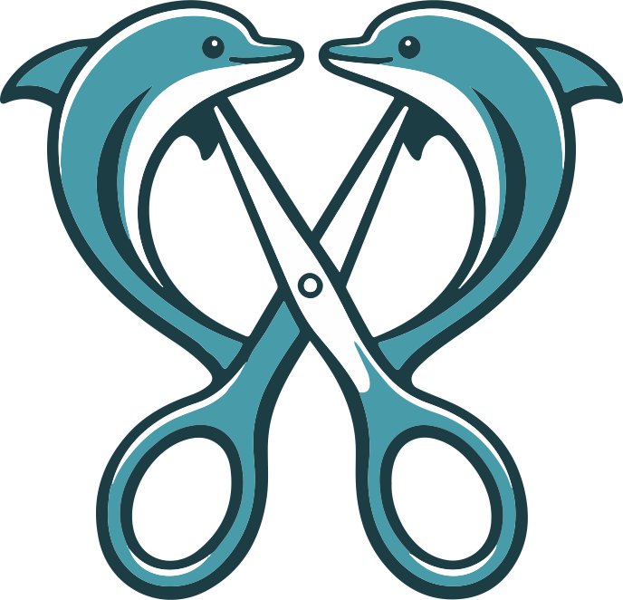

<p align="center">
  
</p>

<h1 align="center">Clipr</h1>

<p align="center">
  <strong>Plateforme web multi-utilisateurs pour segmenter automatiquement des videos longues en extraits thematiques grace a l'IA locale</strong>
</p>

<p align="center">
  
  
  
  
  
  
  
</p>

---

## Table des matieres

- [Fonctionnalites](#fonctionnalites)
- [Architecture](#architecture-docker)
- [Prerequis](#prerequis)
- [Installation](#installation)
- [Configuration](#configuration)
- [Guide utilisateur](#guide-utilisateur)
- [Administration](#administration)
- [API Reference](#api-reference)
- [Securite](#securite)
- [Developpement](#developpement)
- [Licence](#licence)

---

## Fonctionnalites

### Multi-projets
- Jusqu'a **6 projets** simultanes par utilisateur
- Creer, renommer, supprimer des projets depuis la page d'accueil
- Travailler sur un **projet manuel** pendant qu'un **projet IA** s'analyse en arriere-plan
- Badges visuels : type (IA/Manuel), statut (Brouillon/En cours/Termine)

### Analyse IA en arriere-plan
- Pipeline complete cote serveur : extraction audio, transcription, analyse semantique
- L'utilisateur peut naviguer librement pendant le traitement
- Resultats sauvegardes automatiquement en base de donnees
- Progression en temps reel via WebSocket par projet

### Multi-utilisateurs
- Systeme d'authentification JWT (inscription/connexion)
- Isolation des projets par utilisateur
- Premier utilisateur inscrit = **administrateur**
- Roles : `admin` et `user`

### Collaboration
- Partager un projet avec d'autres utilisateurs
- Roles de partage : **Lecteur** (consultation) et **Editeur** (modification)
- Recherche d'utilisateurs pour le partage
- Section "Partages avec moi" sur la page d'accueil

### Verrouillage IA
- Un seul utilisateur peut utiliser l'IA a la fois
- Affichage "IA utilisee par {nom} sur {projet}" pour les autres
- Timeout automatique de 30 minutes
- Liberation automatique en fin de traitement ou en cas d'erreur

### Dashboard Admin
- Vue d'ensemble : stats, sante systeme, statut IA
- Liste de tous les projets de tous les utilisateurs
- Gestion des utilisateurs
- Visualiseur de logs en temps reel

### Transcription avancee
- Modele **Whisper large-v3** pour une qualite optimale
- `initial_prompt` avec vocabulaire de domaine (configurable par projet)
- Vocabulaire pre-configure Vendee/Bretagne : patrimoine, patois, artisanat, musique traditionnelle
- Option **large-v3-turbo** pour un traitement plus rapide

### Analyse semantique
- Modele **mistral-small:22b** par defaut (excellent en francais)
- Decoupe thematique intelligente avec titres et timecodes
- Consignes de decoupe personnalisables par projet

---

## Architecture Docker

```
+-------------------------------------------------------------+
|                      docker-compose                          |
|                                                              |
|  +---------------------+  +--------------+  +------------+  |
|  |       clipr          |  |    ollama     |  |   caddy    |  |
|  |                      |  |              |  |            |  |
|  |  Node.js (Express)   |  |  LLM local   |  |  Reverse   |  |
|  |  SQLite (donnees)    |  |  GPU         |  |  Proxy     |  |
|  |  FFmpeg              |  |              |  |  HTTPS     |  |
|  |  Python/Whisper      |  |              |  |            |  |
|  |  JWT Auth            |  |  :11434      |  |  :443      |  |
|  |  WebSocket           |  |              |  |  :80       |  |
|  |  :3000               |  |              |  |            |  |
|  +---------------------+  +--------------+  +------------+  |
|                                                              |
+-------------------------------------------------------------+
```

| Service | Role | Port | Details |
|---------|------|------|---------|
| **clipr** | Application principale | `3000` | Express, SQLite, FFmpeg, Whisper, JWT |
| **ollama** | Serveur LLM local | `11434` | Acceleration GPU (CUDA/ROCm) |
| **caddy** | Reverse proxy HTTPS | `80/443` | Certificats automatiques Let's Encrypt |

---

## Prerequis

- **Docker** >= 20.10
- **Docker Compose** >= 2.0
- **GPU** recommande :
  - NVIDIA (CUDA) : optimal pour Whisper et Ollama
  - AMD (ROCm) : Ollama fonctionne, Whisper en CPU (`int8`)
  - CPU seul : fonctionne mais plus lent

### Espace disque recommande

| Composant | Taille |
|-----------|--------|
| Image Docker Clipr | ~2 GB |
| Modele Whisper large-v3 | ~3 GB (telecharge au premier usage) |
| Modele mistral-small:22b | ~14 GB |
| Donnees projets | Variable |

---

## Installation

### Installation rapide

```bash
git clone https://github.com/King4Kats/Clipr.git
cd Clipr
docker compose up -d
```

L'application est accessible sur **http://localhost:3000**.

### Premier lancement

1. Ouvrir http://localhost:3000
2. **Creer un compte** — le premier utilisateur devient automatiquement administrateur
3. L'assistant de configuration verifie les dependances (FFmpeg, Whisper, Ollama)
4. Telecharger le modele LLM depuis les parametres si necessaire

---

## Configuration

### Variables d'environnement

| Variable | Defaut | Description |
|----------|--------|-------------|
| `PORT` | `3000` | Port du serveur |
| `DATA_DIR` | `/data` | Repertoire de stockage (DB, uploads, exports) |
| `JWT_SECRET` | Auto-genere | **Important** : definir en production pour persister les sessions |
| `CORS_ORIGINS` | `*` | Origines autorisees (separer par virgule) |
| `OLLAMA_HOST` | `ollama` | Hostname du serveur Ollama |
| `OLLAMA_PORT` | `11434` | Port Ollama |

### Configuration production

```bash
# docker-compose.yml — ajout des variables
services:
  clipr:
    environment:
      - JWT_SECRET=votre-secret-aleatoire-tres-long
      - CORS_ORIGINS=https://clipr.votre-domaine.fr
```

### Nom de domaine (HTTPS)

Modifier `caddy/Caddyfile` :

```
clipr.votre-domaine.fr {
    reverse_proxy clipr:3000
}
```

Caddy obtient automatiquement un certificat Let's Encrypt.

---

## Guide utilisateur

### Inscription et connexion

1. Ouvrir l'application
2. Cliquer **S'inscrire** et remplir : nom d'utilisateur, email, mot de passe
3. Le premier inscrit obtient le role **admin**
4. Les suivants ont le role **user**

### Creer un projet

**Methode 1** : Cliquer le bouton **+ Nouveau** ou la carte **Nouveau Projet**

**Methode 2** : Glisser-deposer un fichier video dans la zone d'upload (cree automatiquement un projet)

### Analyse IA (projet automatique)

1. Importer une ou plusieurs videos dans le projet
2. Configurer les parametres dans le panneau **Assistant IA** :
   - **Modele LLM** : choisir parmi les modeles Ollama installes
   - **Modele Whisper** : `large-v3` (qualite) ou `large-v3-turbo` (vitesse)
   - **Consignes** : instructions personnalisees pour la decoupe
   - **Vocabulaire Whisper** : termes de domaine pour ameliorer la transcription
3. Cliquer **Lancer l'analyse**
4. Le traitement s'execute **en arriere-plan** — vous pouvez :
   - Revenir a l'accueil
   - Travailler sur un autre projet
   - Fermer le navigateur (les resultats sont sauves cote serveur)
5. Le projet passe au statut **Termine** quand l'analyse est finie

### Projet manuel

1. Creer un projet et importer des videos
2. Ajouter des segments manuellement dans la timeline
3. Renommer, reordonner, ajuster les timecodes
4. Exporter les extraits

### Gestion des projets

- **Renommer** : icone crayon au survol d'une carte, ou cliquer le nom dans le header
- **Supprimer** : icone poubelle au survol
- **Partager** : icone partage au survol → modale de partage

### Partage et collaboration

1. Survoler un projet et cliquer l'icone **Partager**
2. Rechercher un utilisateur par nom ou email
3. Choisir le role :
   - **Lecteur** : consultation seule
   - **Editeur** : peut modifier le projet
4. Les projets partages apparaissent dans la section **Partages avec moi**
5. Cliquer sur le badge du role pour le changer (lecteur/editeur)

### Export

- **Video** : export des segments en MP4
- **Texte** : export de la transcription
- **Projet** : export complet en JSON (reimportable)

---

## Administration

Accessible uniquement aux utilisateurs avec le role `admin` (icone bouclier dans le header).

### Vue d'ensemble
- Nombre d'utilisateurs et de projets
- Utilisation du disque
- Statut de l'IA (libre ou utilisee par qui)
- Etat des services (Ollama, FFmpeg)

### Projets
- Tableau de **tous** les projets de tous les utilisateurs
- Proprietaire, type, statut, nombre de segments, date de mise a jour

### Utilisateurs
- Liste des comptes avec role, email, date d'inscription

### Logs
- Visualiseur des 200 dernieres lignes du log serveur
- Coloration syntaxique : erreurs en rouge, warnings en orange
- Rafraichissement manuel

---

## API Reference

### Authentification

| Methode | Route | Auth | Description |
|---------|-------|------|-------------|
| POST | `/api/auth/register` | Non | Inscription (rate-limited: 10/15min) |
| POST | `/api/auth/login` | Non | Connexion (rate-limited: 10/15min) |
| GET | `/api/auth/me` | JWT | Profil utilisateur courant |

Toutes les autres routes necessitent un header `Authorization: Bearer <token>`.

### Projets

| Methode | Route | Description |
|---------|-------|-------------|
| GET | `/api/project/history` | Liste des projets de l'utilisateur (max 6) |
| POST | `/api/project/create` | Creer un projet `{name, type}` |
| POST | `/api/project/save` | Sauvegarder `{id, ...data}` |
| POST | `/api/project/autosave` | Auto-sauvegarde |
| GET | `/api/project/load/:id` | Charger un projet (proprietaire ou partage) |
| PATCH | `/api/project/:id/rename` | Renommer `{name}` |
| DELETE | `/api/project/:id` | Supprimer (soft delete) |
| PATCH | `/api/project/:id/status` | Changer le statut `{status}` |
| POST | `/api/project/:id/analyze` | Lancer l'analyse IA en arriere-plan |

### Partage

| Methode | Route | Description |
|---------|-------|-------------|
| POST | `/api/project/:id/share` | Partager `{username, role}` |
| DELETE | `/api/project/:id/share/:userId` | Retirer un partage |
| GET | `/api/project/:id/shares` | Lister les partages |
| GET | `/api/project/shared` | Projets partages avec moi |
| GET | `/api/users/search?q=` | Recherche d'utilisateurs |

### IA

| Methode | Route | Description |
|---------|-------|-------------|
| GET | `/api/ai/status` | Statut du verrou IA |
| GET | `/api/ollama/check` | Verifier si Ollama est actif |
| GET | `/api/ollama/models` | Lister les modeles installes |
| POST | `/api/ollama/pull` | Telecharger un modele |

### Fichiers et exports

| Methode | Route | Description |
|---------|-------|-------------|
| POST | `/api/upload` | Upload de videos (max 5 GB, formats video uniquement) |
| GET | `/api/files/:filename` | Streamer un fichier upload |
| POST | `/api/export/segment` | Exporter un segment video |
| POST | `/api/export/text` | Exporter du texte |
| GET | `/api/export/download/:filename` | Telecharger un export |

### Administration (admin uniquement)

| Methode | Route | Description |
|---------|-------|-------------|
| GET | `/api/admin/users` | Liste de tous les utilisateurs |
| GET | `/api/admin/projects` | Liste de tous les projets |
| GET | `/api/admin/system` | Sante systeme (disque, services, IA) |
| GET | `/api/admin/logs?lines=N` | Dernieres lignes de log |
| POST | `/api/update` | Declencher une mise a jour |

### WebSocket

Connexion : `ws://host/ws`

**Messages client -> serveur :**

```json
{"type": "auth", "token": "jwt-token"}
{"type": "subscribe", "projectId": "uuid"}
{"type": "unsubscribe"}
```

**Messages serveur -> client :**

```json
{"type": "progress", "projectId": "uuid", "step": "transcribing", "progress": 45, "message": "..."}
{"type": "transcript:segment", "projectId": "uuid", "id": "0", "start": 1.2, "end": 3.5, "text": "..."}
{"type": "analysis:complete", "projectId": "uuid", "segments": [...], "transcript": [...]}
{"type": "analysis:error", "projectId": "uuid", "message": "..."}
```

---

## Securite

### Mesures implementees

- **Authentification JWT** sur toutes les routes sensibles
- **Rate limiting** sur login/register (10 tentatives / 15 minutes)
- **Bcrypt** pour le hachage des mots de passe (10 rounds)
- **Path traversal protection** : validation `resolve()` + `startsWith()` sur tous les endpoints fichiers
- **IDOR protection** : verification de propriete sur toutes les operations projet
- **Validation des uploads** : types MIME video/audio uniquement, noms de fichiers assainis
- **WebSocket authentifie** : token JWT requis avant souscription
- **Soft delete** : les projets supprimes ne sont pas effaces physiquement
- **CORS configurable** via `CORS_ORIGINS`
- **JWT secret** : genere aleatoirement si non configure (definir `JWT_SECRET` en production)

### Recommandations production

1. **Definir `JWT_SECRET`** avec une valeur aleatoire forte (32+ caracteres)
2. **Configurer `CORS_ORIGINS`** avec votre domaine
3. **HTTPS** via Caddy (automatique avec un nom de domaine)
4. **Sauvegardes** regulieres du volume `clipr-data` (contient la DB SQLite et les fichiers)

---

## Developpement

### Structure du projet

```
Clipr/
  server/                    # Backend Express
    index.ts                 # Routes API, WebSocket, middleware
    logger.ts                # Systeme de logs
    middleware/
      auth.ts                # Middleware JWT (requireAuth, requireAdmin)
    services/
      database.ts            # SQLite (schema, migrations)
      auth.ts                # Inscription, connexion, JWT
      project-history.ts     # CRUD projets (scope par utilisateur)
      sharing.ts             # Partage de projets
      ai-lock.ts             # Verrouillage IA
      whisper.ts             # Transcription (spawn Python)
      ollama.ts              # Analyse LLM (HTTP client)
      ffmpeg.ts              # Operations video
  src/                       # Frontend React
    api.ts                   # Client HTTP/WebSocket avec auth JWT
    store/
      useStore.ts            # Store Zustand (etat projet actif)
      useAuthStore.ts        # Store auth (login, register, token)
    components/
      AuthScreen.tsx         # Page login/register
      AdminDashboard.tsx     # Dashboard admin (4 onglets)
      ShareDialog.tsx        # Modale de partage
      SetupWizard.tsx        # Assistant premier lancement
      new/
        Header.tsx           # Barre de navigation
        AIAnalysisPanel.tsx  # Panneau config + lancement IA
        EditorLayout.tsx     # Editeur NLE
        VideoPreview.tsx     # Lecteur video
        Timeline.tsx         # Timeline des segments
        ProgressPanel.tsx    # Ecran de progression
        UploadZone.tsx       # Zone d'upload drag & drop
    types/
      index.ts               # Interfaces TypeScript
  scripts/
    transcribe.py            # Script Python faster-whisper
  docs/
    index.html               # Documentation technique
  Dockerfile                 # Image Docker multi-stage
  docker-compose.yml         # Orchestration des services
```

### Lancer en mode developpement

```bash
npm install
npm run dev          # Client (Vite HMR) + Serveur (tsx watch)
```

### Build de production

```bash
npm run build        # Build client (Vite) + serveur (TypeScript)
npm start            # Lancer le serveur de production
```

### Base de donnees

SQLite stockee dans `DATA_DIR/clipr.db`. Tables :

| Table | Description |
|-------|-------------|
| `users` | Comptes utilisateurs (id, username, email, password_hash, role) |
| `projects` | Projets (id, user_id, name, type, status, data JSON, timestamps) |
| `project_shares` | Partages (project_id, user_id, role) |
| `ai_locks` | Verrous IA (user_id, project_id, expires_at) |

### Stack technique

| Couche | Technologie |
|--------|-------------|
| Frontend | React 18, TypeScript, Zustand, Tailwind CSS, Framer Motion |
| Backend | Express.js, TypeScript, better-sqlite3 |
| Auth | JWT (jsonwebtoken), bcrypt |
| Video | FFmpeg (fluent-ffmpeg) |
| Transcription | faster-whisper (Python), modele large-v3 |
| Analyse | Ollama (mistral-small:22b par defaut) |
| Temps reel | WebSocket (ws) par projet |
| Deploiement | Docker Compose, Caddy (HTTPS) |

---

## Commandes Docker

| Commande | Description |
|----------|-------------|
| `docker compose up -d` | Demarrer tous les services |
| `docker compose down` | Arreter tous les services |
| `docker compose logs -f clipr` | Logs Clipr en temps reel |
| `docker compose restart clipr` | Redemarrer Clipr |
| `docker compose build --no-cache` | Reconstruire sans cache |
| `docker compose exec clipr sh` | Shell dans le conteneur |

---

## Licence

Ce projet est distribue sous licence **MIT**. Voir le fichier [LICENSE](LICENSE) pour les details.

---

<p align="center">
  <sub>Fait avec par <a href="https://github.com/King4Kats">King4Kats</a></sub>
</p>
